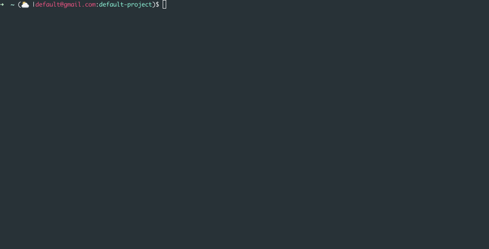

gcloud-ps1: GCloud prompt for bash and zsh
============================================

Clone from [Jon Mosco' awesome project](https://github.com/jonmosco/kube-ps1)

A script that lets you add the current gcloud account and project
configured on `gcloud` to your Bash/Zsh prompt strings (i.e. the `$PS1`).

Inspired by several tools used to simplify usage of `kubectl`.



## Installing

### From Source

1. Clone this repository
2. Source the kube-ps1.sh in your `~/.zshrc` or your `~/.bashrc`

#### Zsh
```sh
# ~/.zshrc
source /path/to/gcloud-ps1.sh
PROMPT+='$(gcloud_ps1)$ '
```
#### Bash
```sh
# ~/.bashrc
source /path/to/gcloud-ps1.sh
PS1='[\u@\h \W $(gcloud_ps1)]\$ '
```

## Requirements

The default prompt assumes you have the `gcloud` command line utility installed.

## Helper utilities

There are several great tools that make using kubectl very enjoyable:

- [`kubectx` and `kubens`](https://github.com/ahmetb/kubectx) are great for
fast switching between clusters and namespaces.

## Prompt Structure

The default prompt layout is:

```
(<symbol>|<account>:<project>)
```

If the account or prokect is not available, gcloud-ps1 will return the following:

```
(<symbol>|N/A:N/A)
```

## Enabling/Disabling

If you want to stop showing gcloud status on your prompt string temporarily
run `gcloudoff`. To disable the prompt for all shell sessions, run `gcloudoff -g`.
You can enable it again in the current shell by running `gcloudon`, and globally
with `gcloudon -g`.

```
gcloudon     : turn on gcloud-ps1 status for this shell.  Takes precedence over
             global setting for current session
gcloudon -g  : turn on gcloud-ps1 status globally
gcloudoff    : turn off gcloud-ps1 status for this shell. Takes precedence over
             global setting for current session
gcloudoff -g : turn off gcloud-ps1 status globally
```

## Customization

The default settings can be overridden in `~/.bashrc` or `~/.zshrc` by setting
the following environment variables:

| Variable | Default | Meaning |
| :------- | :-----: | ------- |
| `GCLOUD_PS1_BINARY` | `gcloud` | Default Kubernetes binary |
| `GCLOUD_PS1_PJ_ENABLE` | `true` | Display the project. If set to `false`, this will also disable `GCLOUD_PS1_DIVIDER` |
| `GCLOUD_PS1_PREFIX` | `(` | Prompt opening character  |
| `GCLOUD_PS1_SYMBOL_ENABLE` | `true ` | Display the prompt Symbol. If set to `false`, this will also disable `GCLOUD_PS1_SEPARATOR` |
| `GCLOUD_PS1_SYMBOL_PADDING` | `true` | Adds a space (padding) after the symbol to prevent clobbering prompt characters |
| `GCLOUD_PS1_SYMBOL_DEFAULT` | `⛅` | Default prompt symbol. Unicode `\u26C5` |
| `GCLOUD_PS1_SEPARATOR` | &#124; | Separator between symbol and context name |
| `GCLOUD_PS1_DIVIDER` | `:` | Separator between context and namespace |
| `GCLOUD_PS1_SUFFIX` | `)` | Prompt closing character |
| `GCLOUD_PS1_ACCOUNT_FUNCTION` | No default, must be user supplied | Function to customize how account is displayed |
| `GCLOUD_PS1_PROJECT_FUNCTION` | No default, must be user supplied | Function to customize how project is displayed |


To disable a feature, set it to an empty string:

```
GCLOUD_PS1_SEPARATOR=''
```

## Colors

The default colors are set with the following environment variables:

| Variable | Default | Meaning |
| :------- | :-----: | ------- |
| `GCLOUD_PS1_SYMBOL_COLOR` | `blue` | Set default color of the gcloud symbol |
| `GCLOUD_PS1_ACC_COLOR` | `red` | Set default color of the account |
| `GCLOUD_PS1_PJ_COLOR` | `cyan` | Set default color of the project |
| `GCLOUD_PS1_BG_COLOR` | `null` | Set default color of the prompt background |


Set the variable to an empty string if you do not want color for each
prompt section:

```
GCLOUD_PS1_CTX_COLOR=''
```

Names are usable for the following colors:

```
black, red, green, yellow, blue, magenta, cyan
```

256 colors are available by specifying the numerical value as the variable
argument.

## Customize display of account and project

You can change how the account name and project are displayed using the
`GCLOUD_PS1_ACCOUNT_FUNCTION` and `GCLOUD_PS1_PROJECT_FUNCTION` variables
respectively.

For the following examples let's assume the following:

- account: `dummy@gmail.com`
- project: `alpha`

Sometimes your prompt will get quite long. Let's say you only want to display the first portion of the
account name (`dummy`), you could do that by adding the following:

```sh
function get_account_short() {
  echo "$1" | cut -d @ -f1
}

GCLOUD_PS1_ACCOUNT_FUNCTION=get_account_short
```

The same pattern can be followed to customize the display of the namespace.
Let's say you would prefer the namespace to be displayed in all uppercase
(`ALPHA`), here's one way you could do that:

```sh
function get_project_upper() {
    echo "$1" | tr '[:lower:]' '[:upper:]'
}

export GCLOUD_PS1_PROJECT_FUNCTION=get_project_upper
```

In both cases, the variable is set to the name of the function, and you must have defined the function in your shell configuration before `gcloud_ps1` is called. The function must accept a single parameter and echo out the final value.
